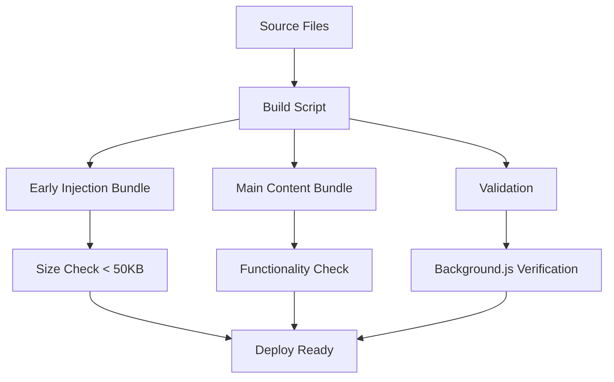

# Build and Deployment Procedures

## Overview

KeyPilot uses a custom build system that creates two separate bundles for the two-phase injection architecture. This document covers the complete build and deployment process, including early injection optimization and validation procedures.

## Build Architecture

### Two-Bundle System

The build system generates two distinct JavaScript bundles:

1. **Early Injection Bundle** (`early-injection.js`)
   - **Purpose**: Immediate visual feedback during page load
   - **Timing**: Executes at `document_start`
   - **Size Target**: < 50KB for optimal performance
   - **Modules**: Critical styles, state bridge, early injection logic

2. **Main Content Bundle** (`content-bundled.js`)
   - **Purpose**: Full KeyPilot functionality
   - **Timing**: Executes at `document_idle`
   - **Size**: No strict limit (currently ~200KB)
   - **Modules**: Complete application logic and UI management

### Build Process Flow



## Build Commands

### Standard Build

```bash
# Build both bundles
node build.js
```

**Output:**
```
Starting build...
Building early injection bundle...
Processing early injection module src/early-injection-styles.js...
Processing early injection module src/modules/state-bridge.js...
Processing early injection module src/early-injection.js...
Generated early-injection.js

Building main content script bundle...
Processing src/config/constants.js...
[... all modules ...]
Generated content-bundled.js

Build complete! Extension files ready:
  - early-injection.js (15.2KB) - document_start
  - content-bundled.js (187.4KB) - document_idle
  - background.js (service worker)
```

### Development Build with Monitoring

```bash
# Build with file watching (requires nodemon)
npx nodemon --watch src --exec "node build.js"
```

### Production Build with Optimization

```bash
# Build with minification (future enhancement)
NODE_ENV=production node build.js
```

## Build Configuration

### Module Dependencies

#### Early Injection Modules
```javascript
const earlyInjectionModules = [
  'src/early-injection-styles.js',    // Critical CSS and HTML generation
  'src/modules/state-bridge.js',      // State management during transitions
  'src/early-injection.js'            // Main early injection logic
];
```

**Optimization Rules:**
- Keep modules minimal and focused
- Avoid heavy dependencies
- Use efficient DOM manipulation
- Minimize CSS payload

#### Main Content Modules
```javascript
const modules = [
  'src/config/constants.js',
  'src/modules/state-manager.js',
  'src/modules/event-manager.js',
  'src/modules/cursor.js',
  'src/modules/element-detector.js',
  'src/modules/activation-handler.js',
  'src/modules/focus-detector.js',
  'src/modules/overlay-manager.js',
  'src/modules/style-manager.js',
  'src/modules/shadow-dom-manager.js',
  'src/modules/intersection-observer-manager.js',
  'src/modules/optimized-scroll-manager.js',
  'src/modules/keypilot-toggle-handler.js',
  'src/modules/hud-manager.js',
  'src/keypilot.js',
  'src/content-script.js'
];
```

### Bundle Processing

The build script performs several transformations:

1. **Import/Export Removal**: Converts ES6 modules to IIFE format
2. **Module Concatenation**: Combines all modules into single files
3. **Comment Injection**: Adds module boundaries for debugging
4. **Size Monitoring**: Tracks bundle sizes for optimization

```javascript
// Example transformation
// Before (ES6 module):
import { StateManager } from './state-manager.js';
export class Cursor { ... }

// After (bundled):
// Module: src/modules/cursor.js
class Cursor { ... }
```

## Deployment Procedures

### Local Development Deployment

1. **Build the Extension:**
```bash
node build.js
```

2. **Load in Chrome:**
   - Open `chrome://extensions/`
   - Enable "Developer mode"
   - Click "Load unpacked"
   - Select the project directory

3. **Verify Installation:**
```bash
# Run quick validation
open tests/extension-validation.html
```

### Testing Deployment

1. **Run Automated Tests:**
```bash
# Test early injection functionality
npm test -- tests/early-injection-unit.test.js
npm test -- tests/early-injection-integration.test.js

# Test main functionality
npm run test:toggle
npm test -- tests/hud-cross-tab-sync.test.js
```

2. **Manual Testing:**
```bash
# Test early injection timing
open test-early-injection-performance.html

# Test two-phase operation
open test-cursor-two-phase-operation.html
open test-hud-two-phase-operation.html
```

3. **Performance Validation:**
```bash
# Test page load impact
npm test -- tests/early-injection-performance.test.js
```

### Production Deployment

#### Pre-Deployment Checklist

- [ ] All tests passing
- [ ] Early injection bundle < 50KB
- [ ] No console errors in test pages
- [ ] Cross-browser compatibility verified
- [ ] Performance impact < 10ms measured
- [ ] State persistence working across navigation
- [ ] Fallback mechanisms tested

#### Chrome Web Store Deployment

1. **Prepare Release Build:**
```bash
# Clean build
rm -f early-injection.js content-bundled.js
node build.js

# Verify bundle sizes
ls -lh *.js
```

2. **Package Extension:**
```bash
# Create deployment package (exclude development files)
zip -r keypilot-extension.zip . \
  -x "node_modules/*" \
  -x "tests/*" \
  -x "test-*.html" \
  -x "src/*" \
  -x "docs/*" \
  -x ".git/*" \
  -x "*.md" \
  -x "build.js" \
  -x "package*.json"
```

3. **Upload to Chrome Web Store:**
   - Go to Chrome Web Store Developer Dashboard
   - Upload `keypilot-extension.zip`
   - Update store listing if needed
   - Submit for review

#### Enterprise Deployment

For enterprise environments:

1. **Create Policy Files:**
```json
// enterprise-policy.json
{
  "ExtensionInstallForcelist": [
    "keypilot-extension-id;https://clients2.google.com/service/update2/crx"
  ]
}
```

2. **Deploy via Group Policy:**
   - Add policy to Windows Group Policy
   - Configure Chrome management settings
   - Test deployment on sample machines

## Build Optimization

### Performance Monitoring

The build system includes automatic performance monitoring:

```javascript
// Bundle size warnings
if (earlyInjectionSize > 50000) { // 50KB threshold
  console.warn(`WARNING: Early injection bundle is ${(earlyInjectionSize / 1024).toFixed(1)}KB. Consider optimizing for faster page load.`);
}
```

### Optimization Strategies

#### Early Injection Bundle Optimization

1. **CSS Minification:**
```javascript
// Future enhancement: CSS minification
function minifyCSS(css) {
  return css
    .replace(/\s+/g, ' ')
    .replace(/;\s*}/g, '}')
    .replace(/\s*{\s*/g, '{')
    .replace(/;\s*/g, ';')
    .trim();
}
```

2. **Dead Code Elimination:**
```javascript
// Remove unused functions from early injection
function removeUnusedCode(code) {
  // Analyze function usage and remove unused code
  return code;
}
```

3. **Variable Name Shortening:**
```javascript
// Shorten variable names for size reduction
function shortenVariableNames(code) {
  // Replace long variable names with short ones
  return code;
}
```

#### Main Bundle Optimization

1. **Lazy Loading:**
```javascript
// Load non-critical modules on demand
async function loadModule(moduleName) {
  const module = await import(`./modules/${moduleName}.js`);
  return module;
}
```

2. **Code Splitting:**
```javascript
// Split large modules into smaller chunks
const coreModules = ['state-manager', 'event-manager'];
const featureModules = ['hud-manager', 'cursor'];
```

### Build Performance

Monitor build performance:

```bash
# Time the build process
time node build.js

# Monitor file sizes
ls -lh *.js | grep -E "(early-injection|content-bundled)"
```

## Continuous Integration

### GitHub Actions Workflow

```yaml
# .github/workflows/build.yml
name: Build and Test

on: [push, pull_request]

jobs:
  build:
    runs-on: ubuntu-latest
    
    steps:
    - uses: actions/checkout@v2
    
    - name: Setup Node.js
      uses: actions/setup-node@v2
      with:
        node-version: '18'
    
    - name: Install dependencies
      run: npm install
    
    - name: Build extension
      run: node build.js
    
    - name: Run tests
      run: npm test
    
    - name: Check bundle sizes
      run: |
        EARLY_SIZE=$(stat -c%s early-injection.js)
        if [ $EARLY_SIZE -gt 51200 ]; then
          echo "Early injection bundle too large: ${EARLY_SIZE} bytes"
          exit 1
        fi
    
    - name: Upload artifacts
      uses: actions/upload-artifact@v2
      with:
        name: extension-bundles
        path: |
          early-injection.js
          content-bundled.js
```

### Automated Testing

```bash
# Pre-commit hook
#!/bin/sh
# .git/hooks/pre-commit

echo "Running pre-commit checks..."

# Build extension
node build.js || exit 1

# Run tests
npm test || exit 1

# Check bundle sizes
EARLY_SIZE=$(stat -c%s early-injection.js 2>/dev/null || stat -f%z early-injection.js)
if [ $EARLY_SIZE -gt 51200 ]; then
  echo "Error: Early injection bundle too large (${EARLY_SIZE} bytes > 50KB)"
  exit 1
fi

echo "Pre-commit checks passed!"
```

## Troubleshooting Build Issues

### Common Build Problems

#### 1. Module Not Found Errors

**Error:**
```
Early injection module not found: src/early-injection.js
```

**Solution:**
```bash
# Check file exists
ls -la src/early-injection.js

# Verify file path in build.js
grep "early-injection.js" build.js
```

#### 2. Bundle Size Too Large

**Error:**
```
WARNING: Early injection bundle is 75.3KB. Consider optimizing for faster page load.
```

**Solution:**
```bash
# Analyze bundle contents
grep -n "Module:" early-injection.js

# Remove unnecessary modules from earlyInjectionModules array
# Optimize CSS in early-injection-styles.js
```

#### 3. Background.js Missing

**Error:**
```
ERROR: background.js not found! Extension will not work properly.
```

**Solution:**
```bash
# Verify background.js exists
ls -la background.js

# If missing, create or restore from backup
```

### Build Script Debugging

Enable verbose logging:

```javascript
// Add to build.js
const DEBUG = process.env.BUILD_DEBUG === 'true';

function debugLog(message) {
  if (DEBUG) {
    console.log(`[DEBUG] ${message}`);
  }
}
```

Run with debugging:
```bash
BUILD_DEBUG=true node build.js
```

## Version Management

### Semantic Versioning

Follow semantic versioning for releases:

- **Major** (1.0.0): Breaking changes to early injection architecture
- **Minor** (1.1.0): New features, performance improvements
- **Patch** (1.1.1): Bug fixes, small optimizations

### Release Process

1. **Update Version:**
```json
// manifest.json
{
  "version": "1.2.0",
  "version_name": "1.2.0 - Early Injection"
}
```

2. **Tag Release:**
```bash
git tag -a v1.2.0 -m "Release 1.2.0 - Early Injection"
git push origin v1.2.0
```

3. **Generate Changelog:**
```bash
# Document changes since last release
git log --oneline v1.1.0..v1.2.0 > CHANGELOG.md
```

## Future Enhancements

### Planned Build Improvements

1. **Webpack Integration:**
   - Replace custom build script with Webpack
   - Add proper minification and optimization
   - Support for source maps in development

2. **TypeScript Support:**
   - Migrate to TypeScript for better type safety
   - Add build-time type checking
   - Generate type definitions

3. **Advanced Optimization:**
   - Tree shaking for unused code elimination
   - Bundle splitting for better caching
   - Compression for smaller payloads

4. **Development Tools:**
   - Hot reloading for faster development
   - Automated testing on file changes
   - Performance profiling integration

### Monitoring and Analytics

1. **Build Metrics:**
   - Track bundle size over time
   - Monitor build performance
   - Alert on size regressions

2. **Deployment Metrics:**
   - Success rate of deployments
   - Performance impact measurements
   - User adoption tracking

## Conclusion

The build and deployment system for KeyPilot's early injection architecture provides a robust foundation for maintaining high performance while delivering immediate visual feedback. The two-bundle approach ensures optimal loading times while maintaining full functionality.

Key benefits:
- ✅ Optimized early injection bundle < 50KB
- ✅ Automated size monitoring and warnings
- ✅ Comprehensive testing integration
- ✅ Production-ready deployment procedures
- ✅ Performance monitoring and optimization
- ✅ Continuous integration support

Regular monitoring of bundle sizes and performance metrics ensures the system continues to meet the < 10ms page load impact target while providing seamless user experience.