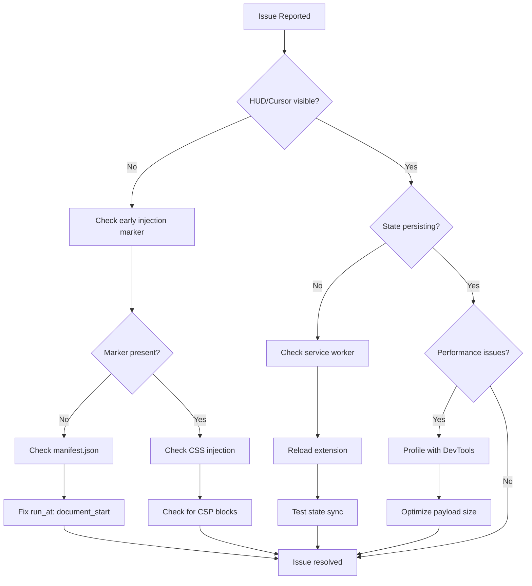

# Early Injection Debugging Guide

## Overview

This guide provides comprehensive troubleshooting steps for diagnosing and resolving issues with KeyPilot's early injection system. Use this guide when experiencing problems with immediate HUD/cursor appearance, state persistence, or performance issues.

## Quick Diagnostic Checklist

Run this checklist first to identify the most common issues:

```javascript
// Paste this in browser console to run quick diagnostics
function quickDiagnostic() {
  const results = {
    earlyInjectionMarker: !!document.querySelector('[data-kpv2-early-injection]'),
    cursorPlaceholder: !!document.getElementById('kpv2-cursor'),
    hudPlaceholder: !!document.getElementById('kpv2-hud'),
    criticalStyles: !!document.querySelector('style[data-kpv2-critical]'),
    mainScriptLoaded: !!window.KeyPilot,
    serviceWorkerActive: false,
    storageAccess: false
  };
  
  // Check service worker
  chrome.runtime.sendMessage({type: 'PING'}, (response) => {
    results.serviceWorkerActive = !!response;
    
    // Check storage access
    chrome.storage.sync.get(['hudVisible'], (data) => {
      results.storageAccess = !chrome.runtime.lastError;
      
      console.table(results);
      
      // Provide quick recommendations
      if (!results.earlyInjectionMarker) {
        console.error('❌ Early injection did not run - check manifest.json');
      }
      if (!results.serviceWorkerActive) {
        console.warn('⚠️ Service worker not responding - reload extension');
      }
      if (!results.storageAccess) {
        console.warn('⚠️ Storage access denied - check permissions');
      }
      if (results.earlyInjectionMarker && results.mainScriptLoaded) {
        console.log('✅ Both injection phases completed successfully');
      }
    });
  });
}

quickDiagnostic();
```

## Common Issues and Solutions

### Issue 1: HUD/Cursor Not Appearing Immediately

**Symptoms:**
- Elements only appear after full page load (2-5 seconds delay)
- No visual elements during page navigation
- "Pop-in" effect when elements appear

**Root Causes:**
1. Early injection script not executing
2. CSS injection blocked
3. DOM access restricted
4. Manifest configuration incorrect

**Diagnostic Steps:**

1. **Check Early Injection Execution:**
```javascript
// Look for early injection marker
const marker = document.querySelector('[data-kpv2-early-injection]');
console.log('Early injection timestamp:', marker?.dataset.timestamp);

// Check for placeholder elements
console.log('Placeholders created:', {
  cursor: !!document.getElementById('kpv2-cursor'),
  hud: !!document.getElementById('kpv2-hud')
});
```

2. **Verify Manifest Configuration:**
```json
// Check manifest.json content_scripts section
{
  "content_scripts": [
    {
      "matches": ["<all_urls>"],
      "js": ["src/early-injection.js"],
      "run_at": "document_start",
      "all_frames": true
    },
    {
      "matches": ["<all_urls>"],
      "js": ["content-bundled.js"],
      "run_at": "document_idle",
      "all_frames": true
    }
  ]
}
```

3. **Check Console for Errors:**
```javascript
// Look for early injection errors
console.log('Early injection errors:', 
  performance.getEntriesByName('early-injection-error'));
```

**Solutions:**

1. **Fix Manifest Issues:**
   - Ensure `src/early-injection.js` exists and is listed first
   - Verify `run_at: "document_start"` is set correctly
   - Check file paths are relative to extension root

2. **Handle CSP Restrictions:**
   - Add CSP permissions to manifest if needed
   - Use inline styles fallback for strict CSP sites
   - Test on different page types

3. **Debug Script Loading:**
   - Check extension is enabled in chrome://extensions/
   - Reload extension after manifest changes
   - Test on simple HTML pages first

### Issue 2: State Not Persisting During Navigation

**Symptoms:**
- HUD collapses on page change
- Cursor mode resets to default
- Settings don't persist across tabs

**Root Causes:**
1. Service worker not responding
2. Storage synchronization failing
3. State bridge not functioning
4. Timing conflicts during navigation

**Diagnostic Steps:**

1. **Test Service Worker Communication:**
```javascript
// Test service worker response
chrome.runtime.sendMessage({type: 'GET_STATE'}, (response) => {
  if (chrome.runtime.lastError) {
    console.error('Service worker error:', chrome.runtime.lastError);
  } else {
    console.log('Service worker state:', response);
  }
});
```

2. **Check Storage Access:**
```javascript
// Test storage read/write
chrome.storage.sync.set({test: 'value'}, () => {
  if (chrome.runtime.lastError) {
    console.error('Storage write failed:', chrome.runtime.lastError);
  } else {
    chrome.storage.sync.get(['test'], (result) => {
      console.log('Storage test result:', result);
    });
  }
});
```

3. **Monitor State Bridge:**
```javascript
// Check state bridge status
if (window.kpv2StateBridge) {
  console.log('State bridge active:', {
    earlyState: window.kpv2StateBridge.earlyState,
    lastSync: window.kpv2StateBridge.lastSyncTime,
    callbacks: window.kpv2StateBridge.transitionCallbacks.size
  });
}
```

**Solutions:**

1. **Restart Service Worker:**
   - Go to chrome://extensions/
   - Click "Reload" on KeyPilot extension
   - Test state persistence again

2. **Clear Storage and Reset:**
```javascript
// Clear all stored state
chrome.storage.sync.clear(() => {
  chrome.storage.local.clear(() => {
    console.log('Storage cleared - reload extension');
  });
});
```

3. **Check Cross-Tab Sync:**
   - Open multiple tabs with KeyPilot
   - Change HUD state in one tab
   - Verify changes appear in other tabs within 1 second

### Issue 3: Performance Impact on Page Load

**Symptoms:**
- Noticeable delay in page loading
- Browser becomes unresponsive briefly
- High CPU usage during navigation

**Root Causes:**
1. Early injection script too large
2. Excessive DOM manipulation
3. Synchronous operations blocking main thread
4. Memory leaks in state management

**Diagnostic Steps:**

1. **Measure Injection Timing:**
```javascript
// Enable performance monitoring
window.KPV2_DEBUG_EARLY_INJECTION = true;

// Check timing after page load
setTimeout(() => {
  const measures = performance.getEntriesByType('measure')
    .filter(m => m.name.includes('kpv2'));
  console.table(measures);
}, 1000);
```

2. **Profile Memory Usage:**
```javascript
// Monitor memory during injection
const memoryBefore = performance.memory?.usedJSHeapSize || 0;
// ... after early injection completes ...
const memoryAfter = performance.memory?.usedJSHeapSize || 0;
console.log('Memory impact:', memoryAfter - memoryBefore, 'bytes');
```

3. **Check DOM Operations:**
```javascript
// Count DOM modifications
let domOperations = 0;
const observer = new MutationObserver((mutations) => {
  domOperations += mutations.length;
});
observer.observe(document, {childList: true, subtree: true});

setTimeout(() => {
  console.log('DOM operations during early injection:', domOperations);
  observer.disconnect();
}, 100);
```

**Solutions:**

1. **Optimize Early Injection Payload:**
   - Minimize CSS size (target < 5KB)
   - Remove unnecessary JavaScript
   - Use efficient DOM manipulation

2. **Use Async Operations:**
```javascript
// Replace synchronous operations
// Bad:
const state = chrome.storage.sync.get(['hudVisible']);

// Good:
chrome.storage.sync.get(['hudVisible'], (state) => {
  // Handle state asynchronously
});
```

3. **Implement Throttling:**
```javascript
// Throttle rapid navigation
let lastInjection = 0;
const INJECTION_THROTTLE = 50; // ms

if (Date.now() - lastInjection > INJECTION_THROTTLE) {
  performEarlyInjection();
  lastInjection = Date.now();
}
```

### Issue 4: Elements Flickering During Page Load

**Symptoms:**
- HUD/cursor briefly disappear and reappear
- Visual "jumping" during page transitions
- Inconsistent element positioning

**Root Causes:**
1. CSS conflicts with page styles
2. Timing issues between injection phases
3. DOM modifications by page scripts
4. Z-index conflicts

**Diagnostic Steps:**

1. **Check CSS Specificity:**
```javascript
// Verify critical styles are applied
const cursor = document.getElementById('kpv2-cursor');
const computedStyle = getComputedStyle(cursor);
console.log('Cursor z-index:', computedStyle.zIndex);
console.log('Cursor position:', computedStyle.position);
```

2. **Monitor Element Visibility:**
```javascript
// Track visibility changes
const observer = new MutationObserver((mutations) => {
  mutations.forEach(mutation => {
    if (mutation.type === 'attributes' && 
        mutation.attributeName === 'style') {
      console.log('Style changed on:', mutation.target.id);
    }
  });
});

observer.observe(document.getElementById('kpv2-cursor'), {
  attributes: true,
  attributeFilter: ['style', 'class']
});
```

**Solutions:**

1. **Increase CSS Specificity:**
```css
/* Use higher specificity and !important */
#kpv2-cursor {
  position: fixed !important;
  z-index: 2147483647 !important;
  display: block !important;
  visibility: visible !important;
}
```

2. **Add Transition Guards:**
```javascript
// Prevent flickering during transitions
function preventFlicker(element) {
  element.style.transition = 'none';
  element.style.opacity = '1';
  element.style.visibility = 'visible';
}
```

3. **Use CSS Custom Properties:**
```css
/* Smooth transitions with CSS variables */
#kpv2-cursor {
  left: var(--cursor-x, 0) !important;
  top: var(--cursor-y, 0) !important;
  transition: left 0.1s ease, top 0.1s ease;
}
```

## Advanced Debugging Techniques

### Enable Debug Mode

Add this to early injection script for detailed logging:

```javascript
// Enable comprehensive debugging
window.KPV2_DEBUG_EARLY_INJECTION = true;
window.KPV2_DEBUG_STATE_BRIDGE = true;
window.KPV2_DEBUG_PERFORMANCE = true;

// Custom debug logger
function debugLog(category, message, data) {
  if (window.KPV2_DEBUG_EARLY_INJECTION) {
    console.log(`[KPV2-${category}]`, message, data || '');
  }
}
```

### Performance Profiling

Use Chrome DevTools for detailed performance analysis:

1. **Open DevTools Performance Tab**
2. **Start Recording**
3. **Navigate to a new page**
4. **Stop Recording after 2-3 seconds**
5. **Look for "early-injection" markers in timeline**

### Network Analysis

Check for unexpected network requests:

```javascript
// Monitor network requests during early injection
const originalFetch = window.fetch;
window.fetch = function(...args) {
  console.log('Fetch during early injection:', args[0]);
  return originalFetch.apply(this, args);
};
```

### Memory Leak Detection

Monitor for memory leaks in state management:

```javascript
// Check for memory leaks
function checkMemoryLeaks() {
  const before = performance.memory?.usedJSHeapSize || 0;
  
  // Force garbage collection (if available)
  if (window.gc) window.gc();
  
  setTimeout(() => {
    const after = performance.memory?.usedJSHeapSize || 0;
    const diff = after - before;
    
    if (diff > 1024 * 1024) { // > 1MB
      console.warn('Potential memory leak detected:', diff, 'bytes');
    }
  }, 5000);
}
```

## Testing Procedures

### Automated Testing

Run the complete test suite:

```bash
# Run all early injection tests
npm test -- --grep "early.injection"

# Run specific test categories
npm test -- tests/early-injection-unit.test.js
npm test -- tests/early-injection-integration.test.js
npm test -- tests/early-injection-performance.test.js
```

### Manual Testing Checklist

1. **Basic Functionality:**
   - [ ] HUD appears within 50ms on page load
   - [ ] Cursor appears within 50ms on page load
   - [ ] No visual flickering during navigation
   - [ ] State persists across page changes

2. **Cross-Tab Synchronization:**
   - [ ] HUD state syncs between tabs
   - [ ] Cursor mode syncs between tabs
   - [ ] Extension toggle syncs between tabs

3. **Performance:**
   - [ ] Page load time impact < 10ms
   - [ ] No browser freezing during injection
   - [ ] Memory usage remains stable

4. **Error Handling:**
   - [ ] Graceful fallback when early injection fails
   - [ ] No JavaScript errors in console
   - [ ] Works on pages with strict CSP

### Browser Compatibility Testing

Test across different browsers and scenarios:

```bash
# Test different page types
open test-early-injection-detection.html      # Static HTML
open test-early-injection-manual.html         # Dynamic content
# Test SPA navigation
# Test pages with strict CSP
# Test pages with heavy JavaScript
```

## Troubleshooting Flowchart



## Getting Help

If issues persist after following this guide:

1. **Collect Debug Information:**
   - Browser version and OS
   - Extension version
   - Console error messages
   - Performance timeline screenshots

2. **Create Minimal Reproduction:**
   - Identify specific pages where issue occurs
   - Document exact steps to reproduce
   - Note any browser extensions that might conflict

3. **Check Known Issues:**
   - Review GitHub issues for similar problems
   - Check if issue is browser-specific
   - Verify extension permissions are correct

4. **Report Bug with Details:**
   - Include debug information collected
   - Provide minimal reproduction steps
   - Attach relevant screenshots or recordings

## Conclusion

This debugging guide covers the most common issues with early injection and provides systematic approaches to diagnosis and resolution. The key to successful debugging is methodical testing and understanding the two-phase injection architecture.

Remember:
- Always check the basics first (manifest, permissions, console errors)
- Use the provided diagnostic tools and test pages
- Profile performance when experiencing slowdowns
- Test across different page types and browsers
- Enable debug mode for detailed logging when needed